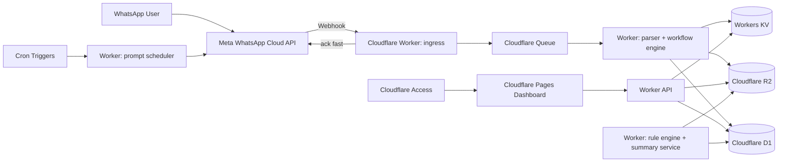
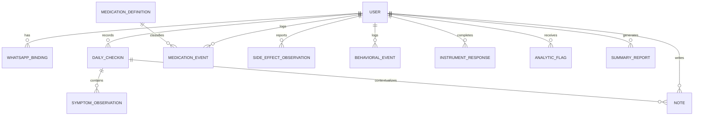

# 02 Design Document

## 1. Design goal

Deliver the fastest realistic version of the product without building a fake-clinical system.

That means:
- WhatsApp for frictionless intake
- Cloudflare for hosting/runtime
- one private dashboard user in MVP
- clinician exports instead of live clinician accounts
- rule-based analytics first, optional LLM summary second

## 2. Architecture overview

### 2.1 Recommended MVP stack

| Layer | Choice | Why |
|---|---|---|
| Messaging interface | WhatsApp Business Platform (Cloud API) | Native WhatsApp experience, webhook-based inbound flow |
| Webhook/API runtime | Cloudflare Workers + Hono | Fast edge runtime, simple webhook/API hosting |
| Front-end | Cloudflare Pages + React + TypeScript | Clean dashboard deployment and preview workflow |
| Primary structured database | Cloudflare D1 | Good fit for normalized longitudinal records in MVP |
| Async processing | Cloudflare Queues | Decouples webhook ack from parsing/analysis/report work |
| Object storage | Cloudflare R2 | Stores exports, report artifacts, optional raw payload archive |
| Ephemeral config/state | Workers KV | Prompt cursors, low-risk settings, cached projections |
| Auth | Cloudflare Access for dashboard | Strong practical protection for a private dashboard |
| Scheduling | Cron Triggers | Daily/weekly prompts and report jobs |
| Observability | Workers logs + metrics; optional Analytics Engine for non-PHI ops data only | Keeps operational insight separate from symptom data |

### 2.2 Architecture diagram

## 3. Key design decisions

### DD-001: Use WhatsApp as input, not as the analytics UI
**Decision:** WhatsApp is the capture surface; the dashboard is the analysis surface.  
**Why:** WhatsApp is excellent for short daily interactions and bad for multi-chart review.

### DD-002: Acknowledge webhooks quickly and process asynchronously
**Decision:** Webhook Worker stores minimal ingress record and pushes work to Queue.  
**Why:** Prevents timeouts and simplifies idempotency/retry behavior.

### DD-003: Use D1 as the prototype system of record
**Decision:** Structured symptom, event, note, medication, and report metadata go into D1.  
**Why:** Longitudinal symptom tracking is relational. Querying trend windows, joins, and exports is easier in SQL than in KV.

### DD-004: Use R2 only for artifacts and optional raw archives
**Decision:** PDFs, CSV exports, and optionally redacted/raw webhook payload snapshots go into R2.  
**Why:** R2 is better for blobs than structured records.

### DD-005: Use Cloudflare Access to gate the dashboard
**Decision:** Protect the dashboard with Access rather than building a custom auth stack first.  
**Why:** Faster hardening for a single-user MVP.

### DD-006: Rule engine first, LLM second
**Decision:** The first analytics layer is deterministic and explainable. LLM narrative synthesis is optional.  
**Why:** The product is health-adjacent. Black-box analysis should not be your first dependency.

### DD-007: MVP is export-to-clinician, not clinician-portal
**Decision:** Only the user gets dashboard access in v1.  
**Why:** This avoids unnecessary complexity and false compliance assumptions.

### DD-008: Use configurable question packs
**Decision:** Symptom prompts are driven by config, not hardcoded text.  
**Why:** You will change the questions.

## 4. Domain model

### 4.1 Core entities

| Entity | Purpose |
|---|---|
| user | patient profile and preferences |
| whatsapp_binding | trusted phone number and channel metadata |
| checkin_session | in-progress guided flow state |
| daily_checkin | canonical daily record |
| symptom_observation | normalized scored observation |
| note | freeform note or journal entry |
| medication_definition | configured medication list |
| medication_event | taken, missed, injected, skipped |
| side_effect_observation | structured tolerability data |
| behavioral_event | tagged incidents such as conflict or risky behavior |
| instrument_definition | screener metadata |
| instrument_response | raw weekly instrument responses and scores |
| analytic_flag | explainable pattern flags |
| summary_report | generated weekly/monthly output metadata |
| audit_event | auth/export/admin actions |
| raw_message | raw inbound/outbound message envelope |

### 4.2 Suggested D1 schema

## 5. Data model detail

### 5.1 `daily_checkin`
- id
- user_id
- checkin_date
- status (`complete`, `partial`, `abandoned`)
- source (`whatsapp`)
- created_at
- updated_at

### 5.2 `symptom_observation`
- id
- daily_checkin_id
- variable_code
- value_numeric
- value_text
- scale_min
- scale_max
- entered_at

### 5.3 `medication_event`
- id
- user_id
- medication_code
- event_type (`taken`, `missed`, `injected`)
- dose_value
- dose_unit
- route
- event_at
- note_id nullable

### 5.4 `side_effect_observation`
- id
- user_id
- linked_medication_event_id nullable
- variable_code
- severity
- observed_on
- observed_at
- note_id nullable

### 5.5 `behavioral_event`
- id
- user_id
- event_date
- tag
- severity
- note
- related_checkin_id nullable

### 5.6 `analytic_flag`
- id
- user_id
- flag_code
- started_on
- ended_on nullable
- severity
- explanation_json
- dismissed_by_user_at nullable

## 6. WhatsApp interaction design

## 6.1 Interaction principles
- keep each question short
- allow natural-language responses
- avoid long forms dumped all at once
- allow commands at any time
- confirm saves briefly
- permit resume after interruption

## 6.2 Primary commands

| Command | Meaning |
|---|---|
| `checkin` | start today's check-in |
| `note:` | save a freeform note |
| `inject` | log Mounjaro injection |
| `missed med` | log missed medication |
| `report month` | queue a monthly report |
| `status` | show today's completion state |

## 6.3 Daily check-in sequence
Recommended order:

1. sleep hours  
2. sleep quality  
3. mood  
4. energy  
5. irritability  
6. focus  
7. racing thoughts  
8. impulsivity / urge to act  
9. interpersonal conflict load  
10. appetite  
11. meds taken?  
12. any side effects?  
13. optional note

Reason: sleep first because it anchors interpretation of everything else.

## 6.4 Injection flow
When the user sends `inject`:
1. ask dose
2. ask injection time if not now
3. ask site
4. ask whether to start a 72-hour symptom watch
5. schedule next-day and +2 day GI/appetite follow-up prompts

## 6.5 Natural-language parser examples
- "slept 4 hours" -> DAT-001 = 4
- "mood was pretty elevated, maybe 4/5" -> DAT-003 = 4
- "missed seroquel last night" -> medication event
- "note: big fight, felt activated, barely ate" -> note + optional tag suggestions

## 7. Analytics design

## 7.1 Analytics layers
1. **descriptive aggregates**  
2. **rule-based flags**  
3. **narrative summary generation**

### 7.2 Descriptive aggregates
- rolling 7-day average sleep
- rolling 7-day average mood/energy
- medication adherence rate by week
- appetite and weight trend
- side-effect intensity by injection day offset
- completion rate and missing-data score

### 7.3 Rule-based flags
Initial MVP flags:

| Flag Code | Trigger logic |
|---|---|
| FLG-HYPO-001 | sleep below baseline for >= 2 days AND energy high AND racing thoughts elevated |
| FLG-HYPO-002 | risk-drive elevated AND impulsivity elevated AND mood elevated |
| FLG-ADHD-001 | focus low for >= 3 of 5 days |
| FLG-CONFLICT-001 | interpersonal conflict elevated with irritability elevated |
| FLG-MJ-001 | nausea/diarrhea/vomiting cluster within 72h of injection |
| FLG-MJ-002 | appetite suppression increased after injection over baseline |
| FLG-MED-001 | repeated missed doses within 7 days |
| FLG-DATA-001 | insufficient data to interpret trend |

Each flag must store:
- exact dates
- contributing variables
- threshold used
- confidence tier (`weak`, `moderate`, `strong`)
- human-readable explanation

### 7.4 Narrative summary engine
The summary engine should:
- pull structured trend data
- cite actual values and date ranges
- summarize notes conservatively
- avoid treatment advice
- label uncertainty

Suggested output sections:
- period overview
- sleep and activation
- attention/focus pattern
- medication adherence
- Mounjaro and side effects
- conflict/behavioral notes
- notable flags
- missing data caveats

### 7.5 LLM usage guidance
If LLM summaries are enabled:
- do not send raw operational logs
- prefer retrieved structured data + selected note excerpts
- require a system prompt that forbids diagnosis/treatment
- store source snippets for auditability
- allow fallback to non-LLM summary mode

## 8. Reporting design

## 8.1 Monthly report contents
1. cover page with period and disclaimer  
2. quick stats  
3. sleep/mood/energy trend  
4. focus/impulsivity/conflict trend  
5. medication adherence  
6. Mounjaro injection and side-effect timeline  
7. weight/appetite summary  
8. top note excerpts  
9. analytic flags with explanations  
10. missing data and caveats

## 8.2 CSV export groups
- daily check-ins
- symptom observations
- notes
- medication events
- side-effect observations
- weekly instruments
- flags

## 9. Security and privacy design

## 9.1 Reality check
This design is for a **private personal-use MVP**. It is not a claim of HIPAA readiness.

### 9.2 Data minimization
- do not put PHI in logs if avoidable
- minimize note excerpt exposure in telemetry
- store only what is needed
- prefer code/value pairs over verbose text where possible

### 9.3 Auth model
- dashboard protected by Cloudflare Access
- only approved identity allowed
- no public sign-up
- report endpoints require authenticated session
- signed URLs expire quickly if used

### 9.4 Secret handling
- Meta tokens in Workers secrets
- report generation secrets isolated per environment
- no secrets in front-end bundle

### 9.5 Auditability
Track:
- login events
- export generation
- admin/config changes
- summary generation
- deletion actions

## 10. Operational design

## 10.1 Worker split
Recommended Workers/services:
- `ingress-worker` — webhook verification + queue publish
- `workflow-worker` — conversation state + parsing + persistence
- `api-worker` — dashboard API
- `report-worker` — PDF/CSV generation
- `scheduler-worker` — cron-triggered prompts and follow-ups

This can start as one repo and one Worker codebase with separated modules, then split later only if needed.

## 10.2 Queue topics
- inbound-message-parse
- scheduled-prompt-send
- report-generate
- analytics-refresh

## 10.3 Environment strategy
- `local`
- `dev`
- `prod`

Each environment should have:
- independent D1 database
- independent R2 bucket prefix
- independent WhatsApp config if practical
- feature flags

## 10.4 Observability
Capture:
- webhook success/failure
- queue backlog/failure
- cron success/failure
- report job duration
- dashboard API latency
- summary generation failure rate

Do **not** send raw symptom notes to operational analytics.

## 11. Future-state design (post-MVP)

Only after the MVP proves useful:
- multi-user support
- clinician accounts and permission model
- instrument library with reviewed licensing
- FHIR/EHR export
- richer event taxonomy
- wearable/sensor imports
- stronger compliance posture with appropriate vendor agreements
